# project_00_rag_agent — 分层架构与核心流程

> **流程图已导出为 PNG**：见 [`docs/diagrams/`](./diagrams/)。**建议先看图 `00` 全项目总览**，再按层阅读分图。修改 `docs/architecture.md` 内 Mermaid 后执行 `python scripts/render_diagrams.py` 重新生成。

> 生产级 RAG Agent：LangGraph + JWT/RBAC + Hybrid 检索 + 知识图谱 + HITL + Redis 缓存

---

## 〇、全项目端到端总览（图 `00`）

**一张图串起**全栈主路径；**细节一律见分图**。`cache` 判断、`invoke`/`astream` 内部步骤**只在 `07`/`08` 展开**，`00` 不重复画菱形。

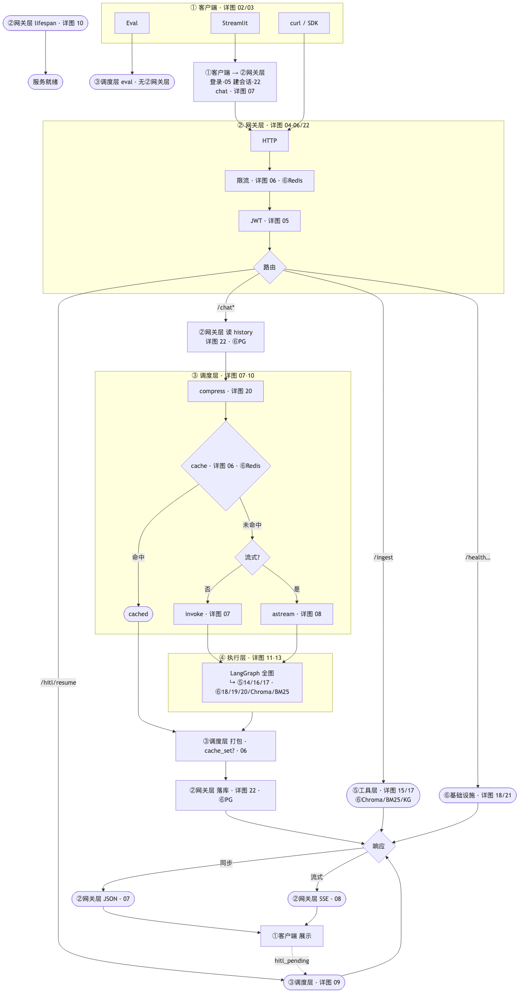

<details>
<summary>查看 Mermaid 源码（可编辑后运行 scripts/render_diagrams.py 重新出图）</summary>

```mermaid
flowchart TD
    BOOT(["②网关层 lifespan · 详图 10"]) --> READY([服务就绪])

    subgraph L1["① 客户端 · 详图 02/03"]
        ST[Streamlit]
        CLI[curl / SDK]
        EVAL[Eval]
    end

    EVAL --> EVAL_DONE(["③调度层 eval · 无②网关层"])

    ST --> L1_API["①客户端 → ②网关层<br/>登录·05 建会话·22<br/>chat · 详图 07"]
    L1_API --> GW
    CLI --> GW

    subgraph L2["② 网关层 · 详图 04–06/22"]
        GW[HTTP] --> RL["限流 · 详图 06 · ⑥Redis"]
        RL --> JWT["JWT · 详图 05"]
        JWT --> ROUTE{路由}
    end

    ROUTE -->|/ingest| ING(["⑤工具层 · 详图 15/17<br/>⑥Chroma/BM25/KG"])
    ROUTE -->|/chat*| CHAT
    ROUTE -->|/hitl/resume| HITL_BOX(["③调度层 · 详图 09"])
    ROUTE -->|/health…| OPS(["⑥基础设施 · 详图 18/21"])

    CHAT["②网关层 读 history<br/>详图 22 · ⑥PG"] --> SCH0

    subgraph SCH["③ 调度层 · 详图 07–10"]
        SCH0["compress · 详图 20"] --> DRV{流式?}
        DRV -->|否| INV["ask · 详图 07"]
        DRV -->|是| AST["ask_stream · 详图 08"]
    end

    subgraph EXEC["④ 执行层 · 详图 11–13"]
        EXEC_NODE["LangGraph 全图<br/>↳ ⑤14/16/17 · ⑥18/19/20/Chroma/BM25"]
    end

    INV -.->|cache 命中| PACK
    INV -->|未命中| EXEC_NODE
    AST -.->|cache 命中| PACK
    AST -->|未命中| EXEC_NODE
    EXEC_NODE --> PACK["③调度层 打包"]

    PACK --> DB["②网关层 落库 · 详图 22 · ⑥PG"]
    DB --> OUT
    ING --> OUT
    OPS --> OUT
    HITL_BOX --> OUT

    OUT{响应}
    OUT -->|同步| JSON(["②网关层 JSON · 07"])
    OUT -->|流式| SSE(["②网关层 SSE · 08"])
    JSON --> UI["①客户端 展示"]
    SSE --> UI

    UI -.->|hitl_pending| HITL_BOX

    %% cache 判断仅在 07/08 详图；00 虚线表示命中短路，不重复画菱形```

</details>

**读图约定**：节点格式 **`[层]层名 步骤 · 详图 NN · ↳ ⑤/⑥`**。六层与详图编号见下表。

| 层 | 名称 | 详图编号 |
|----|------|----------|
| **①** | 客户端 | `02` UI、`03` Eval |
| **②** | 网关层 | `04` HTTP、`05` JWT、`06` 缓存限流、`22` 会话 |
| **③** | 调度层 | **`07`–`10`**（ask / stream / HITL / startup） |
| **④** | 执行层 | **`11`–`13`**（主图 / State / Checkpointer） |
| **⑤** | 工具层 | **`14`–`17`**（检索 / ingest / 冲突 / KG） |
| **⑥** | 基础设施 | **`18`–`21`**（熔断 / 超时 / 压缩 / Docker） |

---

## 一、目录结构总览

```
project_00_rag_agent/
├── agent.py                 # 对外入口：ask / ask_stream / resume_hitl / startup
├── api.py                   # FastAPI HTTP 层
├── app.py                   # Streamlit UI（HTTP 客户端，仅经 api.py）
├── config.py                # pydantic-settings 全量配置
│
├── core/                    # 横切能力
│   ├── compression.py       # 对话压缩 + RAG context 预算
│   ├── timeouts.py          # LLM 调用超时
│   ├── circuit_breaker.py   # LLM/Embed 熔断
│   └── exceptions.py        # 结构化错误码
│
├── middleware/              # 网关中间件
│   ├── auth.py              # JWT + RBAC
│   ├── cache.py             # Redis 答案缓存
│   ├── rate_limit.py        # 限流
│   └── request_context.py   # request_id
│
├── storage/                 # 会话持久化
│   └── conversations.py     # PostgreSQL/SQLite conversations + messages
│
├── providers/               # 模型 Provider 抽象
│   └── factory.py           # Ollama / OpenAI 切换
│
├── graph/                   # LangGraph 核心
│   ├── state.py             # RAGState
│   ├── nodes.py             # guard/rewrite/retrieve/generate/grade/hitl
│   ├── edges.py             # 条件路由
│   ├── builder.py           # 编译图 + interrupt_before
│   └── checkpointer.py      # Memory / Postgres 持久化
│
├── tools/                   # 业务工具
│   ├── retriever.py         # Hybrid + ACL + Rerank + KG
│   ├── ingest.py            # 安全入库
│   ├── knowledge_graph.py   # 三元组存储/查询
│   ├── kg_extractor.py      # 规则 + LLM NER 抽取
│   └── conflict.py          # 文档冲突检测
│
├── prompts/rag_prompts.py   # guard / rewrite / rag / grade
├── observability/metrics.py # 指标计数
├── tests/                   # 单元 + API + 集成测试
├── sample_docs/             # 样例知识库
├── Dockerfile + docker-compose.yml
└── docs/architecture.md     # 本文档
```

---

## 二、六层架构（自上而下）

**阅读顺序**：先看本图建立全栈心智模型 → 再按层阅读第三节～第八节（每层有职责说明 + 专属流程图）。

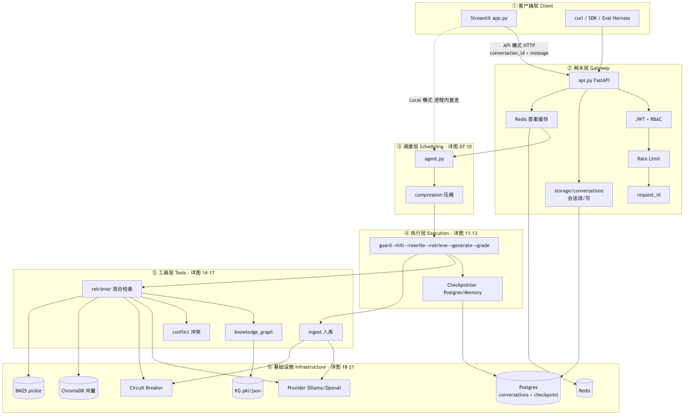

<details>
<summary>查看 Mermaid 源码（可编辑后运行 scripts/render_diagrams.py 重新出图）</summary>

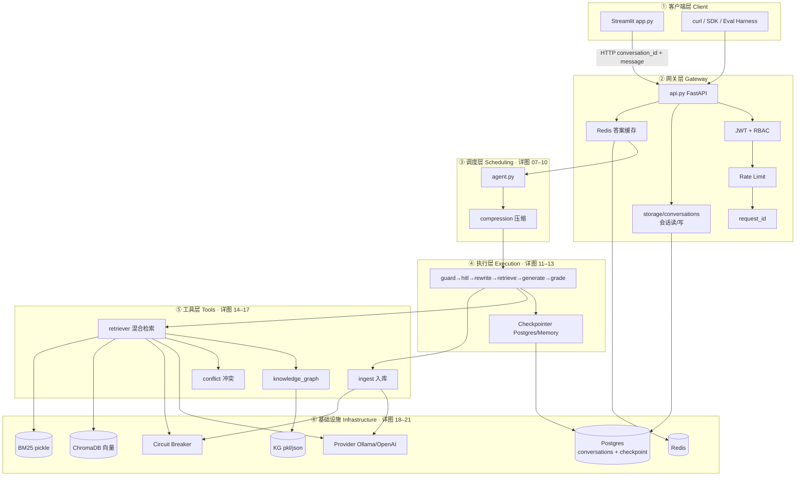
```mermaid
flowchart TB
    subgraph L1["① 客户端层 Client"]
        ST[Streamlit app.py]
        CLI[curl / SDK / Eval Harness]
    end

    subgraph L2["② 网关层 Gateway"]
        API[api.py FastAPI]
        AUTH[JWT + RBAC]
        RL[Rate Limit]
        CACHE[Redis 答案缓存]
        RID[request_id]
        CONV[storage/conversations<br/>会话读/写]
    end

    subgraph L3["③ 调度层 Scheduling · 详图 07–10"]
        AGENT[agent.py]
        COMP[compression 压缩]
    end

    subgraph L4["④ 执行层 Execution · 详图 11–13"]
        GRAPH[guard→hitl→rewrite→retrieve→generate→grade]
        CP[Checkpointer Postgres/Memory]
    end

    subgraph L5["⑤ 工具层 Tools · 详图 14–17"]
        RET[retriever 混合检索]
        ING[ingest 入库]
        KG[knowledge_graph]
        CONF[conflict 冲突]
    end

    subgraph L6["⑥ 基础设施 Infrastructure · 详图 18–21"]
        PROV[Provider Ollama/OpenAI]
        CB[Circuit Breaker]
        CHROMA[(ChromaDB 向量)]
        BM25[(BM25 pickle)]
        KGSTORE[(KG pkl/json)]
        REDIS[(Redis)]
        PG[(Postgres<br/>conversations + checkpoint)]
    end

  ST -->|HTTP conversation_id + message| API
  CLI --> API
  API --> AUTH --> RL --> RID
  API --> CONV
  CONV --> PG
  API --> CACHE --> AGENT
  AGENT --> COMP --> GRAPH
  GRAPH --> CP
  GRAPH --> RET
  GRAPH --> ING
  RET --> KG
  RET --> CONF
  RET --> PROV
  ING --> PROV
  RET --> CB
  ING --> CB
  RET --> CHROMA & BM25
  KG --> KGSTORE
  CACHE --> REDIS
  CP --> PG
```

</details>

### 2.1 分层阅读索引（全栈 → 每层做什么）

| 层 | 职责（一句话） | 主要代码 | 本文章节 | 核心流程图 |
|----|----------------|----------|----------|------------|
| **全栈** | 端到端主路径 + ingest + HITL 汇总 | 全文 | **〇** | **`00` 全项目总览** |
| **① 客户端** | 收集输入、展示结果；经 HTTP 调用网关 | `app.py`, eval harness | **三** | `02` UI 全栈路径、`03` Eval |
| **② 网关层** | 鉴权、限流、答案缓存、request_id；**会话 history 从 Postgres 加载** | `api.py`, `middleware/*`, `storage/conversations.py` | **四** | `04`–`06`、`22` 会话存储 |
| **③ 调度层** | 压缩历史、查答案缓存、组装 state、调用 LangGraph | `agent.py` | **五** | **`07`–`10`** ask / stream / HITL / startup |
| **④ 执行层** | guard/HITL/改写/检索/生成/评分的有状态工作流 | `graph/*` | **六** | **`11`–`13`** 主图 / State / Checkpointer |
| **⑤ 工具层** | 入库、混合检索、KG、冲突检测 | `tools/*` | **七** | **`14`–`17`** 检索 / ingest / 冲突 / KG |
| **⑥ 基础设施** | 模型调用、熔断、超时、持久化存储 | `providers/`, `core/`, 磁盘/Redis/PG | **八** | **`18`–`21`** 熔断 / 超时 / 压缩 / Docker |

**客户端路径**：Streamlit / curl / SDK 均经 **② 网关层** → ③ → ④ → ⑤ → ⑥ → 响应回 UI。

`02_streamlit_ui` 图画出 Streamlit 经网关的完整调用链；**不是** UI 自己生成答案，中间必经 ②～⑥。

---

## 三、层 1：客户端层

**本层职责**：人机交互、会话状态（`conversation_id` / `token` / UI 展示用 `messages`）、把用户操作转为 HTTP 调用；**不负责**检索与生成。**chat_history 由服务端 PostgreSQL 存储**，客户端只传 `conversation_id` + `message`。

### 3.1 Streamlit UI 全栈路径（`app.py`）

下图在 **① 客户端视角** 画出经 **② 网关** 进入 **③～⑥** 的完整调用链。终点 `SHOW` 是网关返回 JSON **之后** 的 UI 渲染。

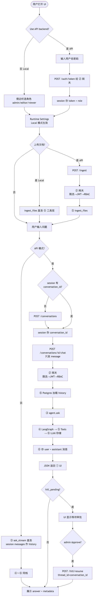

<details>
<summary>查看 Mermaid 源码（可编辑后运行 scripts/render_diagrams.py 重新出图）</summary>

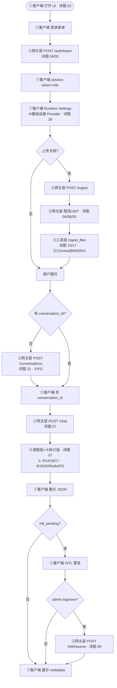
```mermaid
flowchart TD
    START(["①客户端 打开 UI · 详图 02"]) --> LOGIN["①客户端 登录表单"]
    LOGIN --> TOKEN["②网关层 POST /auth/token<br/>详图 04/05"]
    TOKEN --> ROLE["①客户端 session token+role"]

    ROLE --> SETTINGS["①客户端 Runtime Settings<br/>⑥基础设施 Provider · 详图 18"]

    SETTINGS --> INGEST{上传文档?}
    INGEST -->|是| ING_API["②网关层 POST /ingest"]
    INGEST -->|否| CHAT

    ING_API --> GW_ING["②网关层 限流/JWT · 详图 04/06/05"]
    GW_ING --> ING_RUN["⑤工具层 ingest_files<br/>详图 15/17 · ⑥Chroma/BM25/KG"]
    ING_RUN --> CHAT

    CHAT[用户提问] --> ENSURE{有 conversation_id?}
    ENSURE -->|否| CREATE["②网关层 POST /conversations<br/>详图 22 · ⑥PG"]
    CREATE --> CID["①客户端 存 conversation_id"]
    ENSURE -->|是| CID
    CID --> POST_CHAT["②网关层 POST /chat<br/>详图 07"]
    POST_CHAT --> FLOW07["③调度层+④执行层 · 详图 07<br/>↳ ⑤14/16/17 · ⑥18/20/Redis/PG"]
    FLOW07 --> JSON["①客户端 展示 JSON"]
    JSON --> HITL{hitl_pending?}

    HITL -->|是| WARN["①客户端 HITL 警告"]
    HITL -->|否| SHOW["①客户端 展示 metadata"]

    WARN --> ADMIN{admin Approve?}
    ADMIN -->|是| RESUME["②网关层 POST /hitl/resume · 详图 09"]
    ADMIN -->|否| SHOW
    RESUME --> SHOW
```

</details>

### 3.2 Eval Harness 流程（`eval/harness/run_eval.py`）

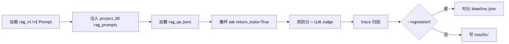

<details>
<summary>查看 Mermaid 源码（可编辑后运行 scripts/render_diagrams.py 重新出图）</summary>

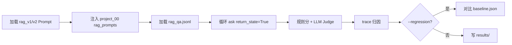
```mermaid
flowchart LR
    E1[加载 rag_v1/v2 Prompt] --> E2[注入 project_00 rag_prompts]
    E2 --> E3[加载 rag_qa.jsonl]
    E3 --> E4[循环 ask return_state=True]
    E4 --> E5[规则分 + LLM Judge]
    E5 --> E6[trace 归因]
    E6 --> E7{--regression?}
    E7 -->|是| E8[对比 baseline.json]
    E7 -->|否| E9[写 results/]
```

</details>

---

## 四、层 2：网关层（`api.py` + `middleware/`）

**读图说明**：`04` 是网关总览；**限流见 `06`**、**JWT/RBAC 见 `05`**。答案缓存在 `api` 中间件里不展开，由 **③调度层** 在 `07`/`08` 里 `cache_get/set`（`06`）；ingest 成功后 **②网关层** 调 `cache_delete_prefix`（`06`）。

### 4.1 请求总入口（所有 HTTP 请求）

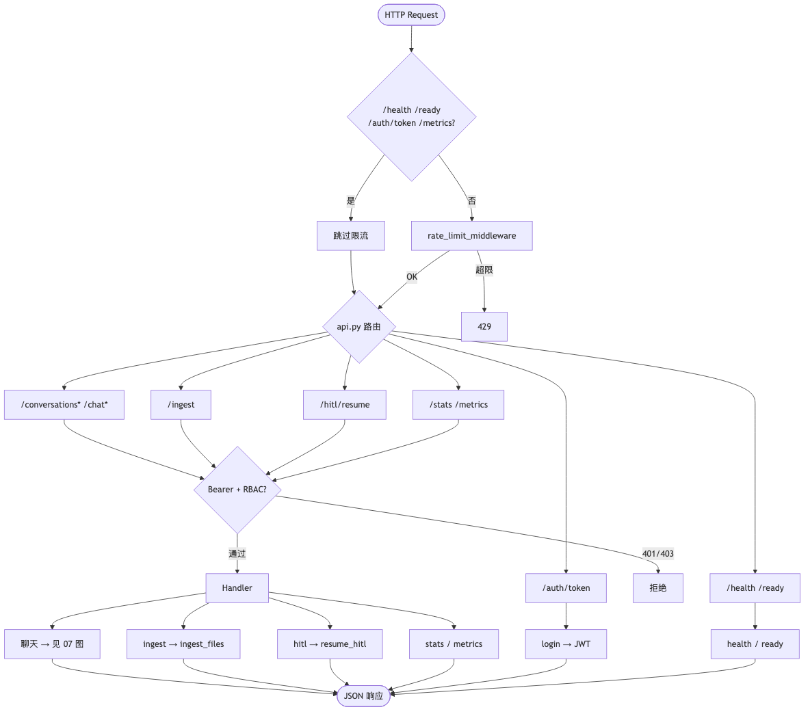

<details>
<summary>查看 Mermaid 源码（可编辑后运行 scripts/render_diagrams.py 重新出图）</summary>

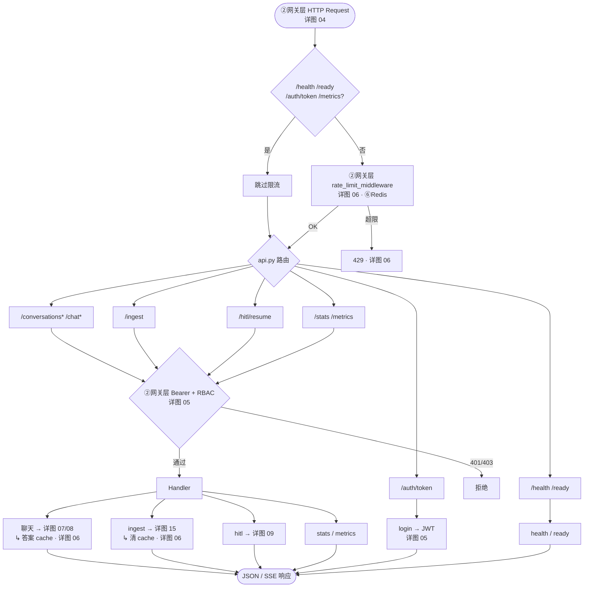
```mermaid
flowchart TD
    REQ(["②网关层 HTTP Request<br/>详图 04"]) --> SKIP{/health /ready<br/>/auth/token /metrics?}
    SKIP -->|是| PASS[跳过限流]
    SKIP -->|否| RL["②网关层 rate_limit_middleware<br/>详图 06 · ⑥Redis"]

    PASS --> ROUTE
    RL -->|超限| E429[429 · 详图 06]
    RL -->|OK| ROUTE{api.py 路由}

    ROUTE --> AUTH["/auth/token"]
    ROUTE --> CHAT["/conversations* /chat*"]
    ROUTE --> INGEST["/ingest"]
    ROUTE --> HITL["/hitl/resume"]
    ROUTE --> OPS_PUB["/health /ready"]
    ROUTE --> OPS_AUTH["/stats /metrics"]

    AUTH --> H1["login → JWT<br/>详图 05"]

    CHAT --> JWT
    INGEST --> JWT
    HITL --> JWT
    OPS_AUTH --> JWT

    OPS_PUB --> H_OPS[health / ready]

    JWT{"②网关层 Bearer + RBAC<br/>详图 05"}
    JWT -->|401/403| ERR[拒绝]
    JWT -->|通过| H2[Handler]

    H2 --> T1["聊天 → 详图 07/08<br/>↳ 答案 cache · 详图 06"]
    H2 --> T2["ingest → 详图 15<br/>↳ 清 cache · 详图 06"]
    H2 --> T3["hitl → 详图 09"]
    H2 --> T4[stats / metrics]

    T1 --> OUT([JSON / SSE 响应])
    T2 --> OUT
    T3 --> OUT
    T4 --> OUT
    H1 --> OUT
    H_OPS --> OUT

    %% ②网关层总览：限流·06 → 鉴权·05 → 路由 Handler；答案缓存在 07/08 调度层调用
```

</details>

### 4.2 JWT 鉴权 + RBAC 流程（`middleware/auth.py`）

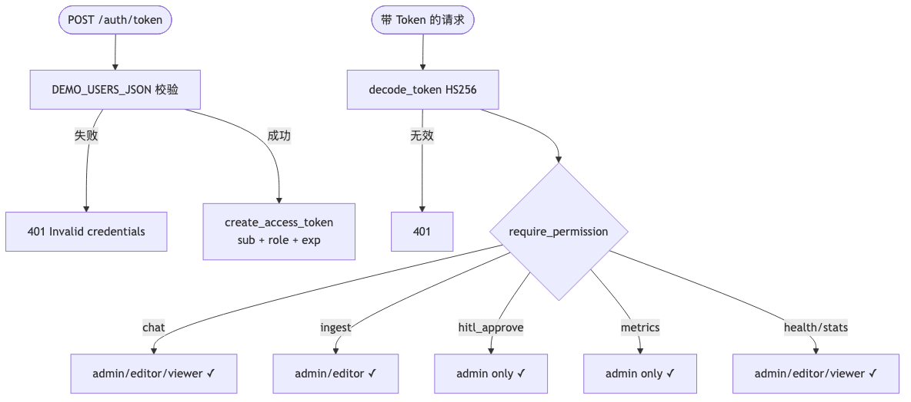

<details>
<summary>查看 Mermaid 源码（可编辑后运行 scripts/render_diagrams.py 重新出图）</summary>


```mermaid
flowchart TD
    LOGIN([POST /auth/token]) --> CHECK[DEMO_USERS_JSON 校验]
    CHECK -->|失败| E401[401 Invalid credentials]
    CHECK -->|成功| JWT[create_access_token<br/>sub + role + exp]

    API([带 Token 的请求]) --> DECODE[decode_token HS256]
    DECODE -->|无效| E401b[401]
    DECODE --> PERM{require_permission}

    PERM -->|chat| R1[admin/editor/viewer ✓]
    PERM -->|ingest| R2[admin/editor ✓]
    PERM -->|hitl_approve| R3[admin only ✓]
    PERM -->|metrics| R4[admin only ✓]
    PERM -->|health/stats| R5[admin/editor/viewer ✓]
```

</details>

**角色权限表：**

| 角色 | chat | ingest | hitl_approve | metrics | health/stats |
|------|------|--------|--------------|---------|--------------|
| admin | ✓ | ✓ | ✓ | ✓ | ✓ |
| editor | ✓ | ✓ | ✗ | ✗ | ✓ |
| viewer | ✓ | ✗ | ✗ | ✗ | ✓ |

### 4.3 缓存 + 限流流程

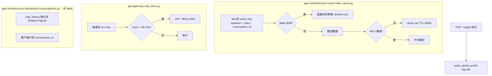

<details>
<summary>查看 Mermaid 源码（可编辑后运行 scripts/render_diagrams.py 重新出图）</summary>

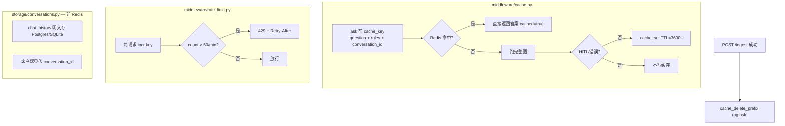
```mermaid
flowchart TD
    subgraph Cache["middleware/cache.py"]
        C1["ask 前 cache_key<br/>question + roles + conversation_id"] --> C2{Redis 命中?}
        C2 -->|是| C3[直接返回答案 cached=true]
        C2 -->|否| C4[跑完整图]
        C4 --> C5{HITL/错误?}
        C5 -->|否| C6[cache_set TTL=3600s]
        C5 -->|是| C7[不写缓存]
    end

    subgraph RateLimit["middleware/rate_limit.py"]
        R1[每请求 incr key] --> R2{count > 60/min?}
        R2 -->|是| R3[429 + Retry-After]
        R2 -->|否| R4[放行]
    end

    subgraph History["storage/conversations.py — 非 Redis"]
        H1[chat_history 明文存 Postgres/SQLite]
        H2[客户端只传 conversation_id]
    end

    INGEST_DONE[POST /ingest 成功] --> CLEAR[cache_delete_prefix rag:ask:]
```

</details>

---

## 五、层 3：调度层（`agent.py`）

**读图说明**：每个节点前缀 **层号+层名**（如 `②网关层`、`③调度层`）；`↳` 表示该步调用的下层 **⑤工具层 / ⑥基础设施** 及 **详图编号**。

**六层标注约定**（与 §〇 读图约定一致）：

| 层 | 名称 | 详图编号 |
|----|------|----------|
| **①** | 客户端 | `02` UI、`03` Eval |
| **②** | 网关层 | `04`–`06`、`22` 会话 |
| **③** | 调度层 | **`07`–`10`** |
| **④** | 执行层 | **`11`–`13`** |
| **⑤** | 工具层 | **`14`–`17`** |
| **⑥** | 基础设施 | **`18`–`21`** |

### 5.1 `ask()` 同步问答主流程

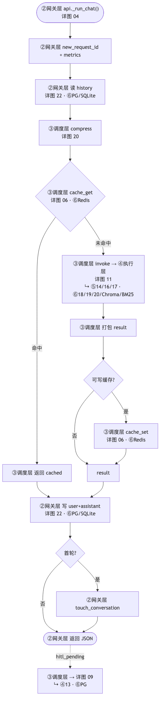

<details>
<summary>查看 Mermaid 源码（可编辑后运行 scripts/render_diagrams.py 重新出图）</summary>

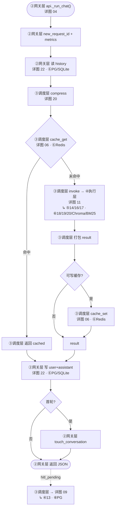
```mermaid
flowchart TD
    START(["②网关层 api._run_chat()<br/>详图 04"]) --> RID["②网关层 new_request_id + metrics"]
    RID --> LOAD["②网关层 读 history<br/>详图 22 · ⑥PG/SQLite"]
    LOAD --> A1["③调度层 compress<br/>详图 20"]
    A1 --> A2{"③调度层 cache_get<br/>详图 06 · ⑥Redis"}

    A2 -->|命中| A2H["③调度层 返回 cached"]
    A2 -->|未命中| A3["③调度层 invoke → ④执行层<br/>详图 11<br/>↳ ⑤14/16/17 · ⑥18/19/20/Chroma/BM25"]

    A3 --> A4["③调度层 打包 result"]
    A4 --> A5{可写缓存?}
    A5 -->|是| A6["③调度层 cache_set<br/>详图 06 · ⑥Redis"]
    A5 -->|否| MERGE[result]
    A6 --> MERGE

    A2H --> SAVE
    MERGE --> SAVE["②网关层 写 user+assistant<br/>详图 22 · ⑥PG/SQLite"]
    SAVE --> TIT{首轮?}
    TIT -->|是| TITLE["②网关层 touch_conversation"]
    TIT -->|否| RETURN
    TITLE --> RETURN(["②网关层 返回 JSON"])

    RETURN -.->|hitl_pending| H09["③调度层 → 详图 09<br/>↳ ④13 · ⑥PG"]

    %% ③调度层=agent.ask()；②网关层=api._run_chat()
```

</details>


### 5.2 会话存储（`storage/conversations.py`）

生产形态：**客户端只传 `conversation_id` + `message`**，`chat_history` 由服务端从 PostgreSQL（无则 SQLite 降级）加载与落库。`conversation_id` 同时作为 LangGraph `thread_id`（HITL 对齐）。

详见 **图 22 会话存储**（§8.5 / `docs/diagrams/22_conversations.png`）。

### 5.3 `ask_stream()` 流式问答流程

与图 `07` 同骨架（①～④ + 缓存 + 全图 **详图 11**）。差异：**先写 user**、**`astream` + yield + SSE**；`hitl_pending` 见 **详图 09**（另一次 HTTP）。

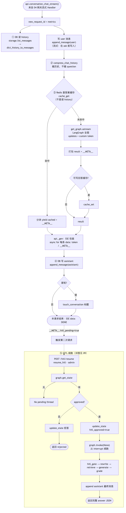

<details>
<summary>查看 Mermaid 源码（可编辑后运行 scripts/render_diagrams.py 重新出图）</summary>

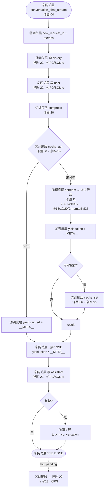
```mermaid
flowchart TD
    START(["②网关层 conversation_chat_stream<br/>详图 04"]) --> RID["②网关层 new_request_id + metrics"]
    RID --> LOAD["②网关层 读 history<br/>详图 22 · ⑥PG/SQLite"]
    LOAD --> UMSG["②网关层 写 user<br/>详图 22 · ⑥PG/SQLite"]

    UMSG --> A1["③调度层 compress<br/>详图 20"]
    A1 --> A2{"③调度层 cache_get<br/>详图 06 · ⑥Redis"}

    A2 -->|命中| A2H["③调度层 yield cached + __META__"]
    A2 -->|未命中| A3["③调度层 astream → ④执行层<br/>详图 11<br/>↳ ⑤14/16/17 · ⑥18/19/20/Chroma/BM25"]

    A3 --> A4["③调度层 yield token + __META__"]
    A4 --> A5{可写缓存?}
    A5 -->|是| A6["③调度层 cache_set<br/>详图 06 · ⑥Redis"]
    A5 -->|否| MERGE[result]
    A6 --> MERGE

    A2H --> WRAP
    MERGE --> WRAP["②网关层 _gen SSE<br/>yield token / __META__"]

    WRAP --> SAVE["②网关层 写 assistant<br/>详图 22 · ⑥PG/SQLite"]
    SAVE --> TIT{首轮?}
    TIT -->|是| TITLE["②网关层 touch_conversation"]
    TIT -->|否| RETURN
    TITLE --> RETURN(["②网关层 SSE DONE"])

    RETURN -.->|hitl_pending| H09["③调度层 → 详图 09<br/>↳ ④13 · ⑥PG"]

    %% 与 07 差异：astream、先写 user、yield+SSE（③调度层 + ②网关层）
```

</details>

### 5.4 `resume_hitl()` HITL 恢复流程

**独立第二次 HTTP**（`07`/`08` 第一次返回 `hitl_pending` 后进入）。已整合在图 `08` 的 ⑤ 节；下图为其详图。

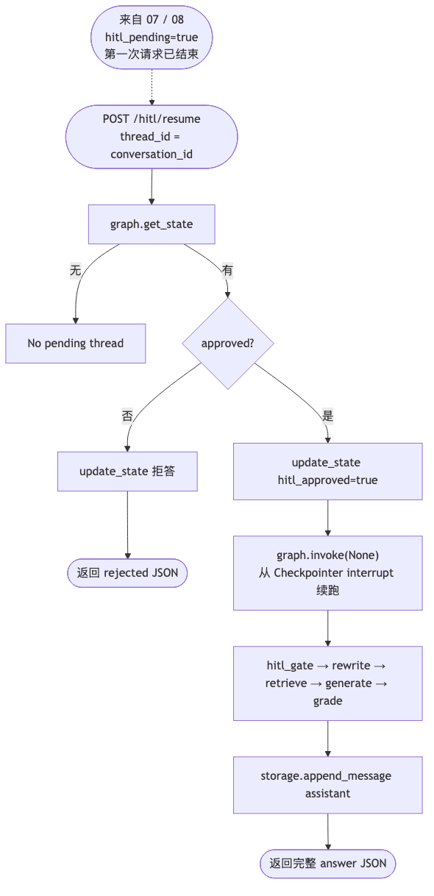

<details>
<summary>查看 Mermaid 源码（可编辑后运行 scripts/render_diagrams.py 重新出图）</summary>

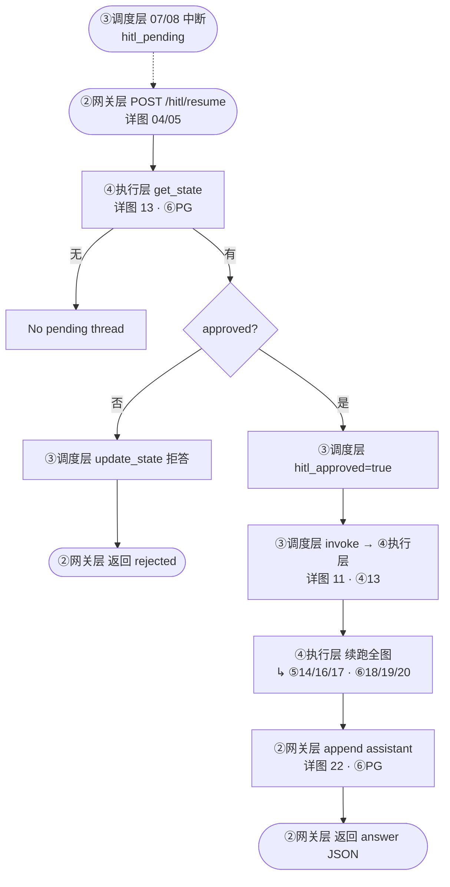
```mermaid
flowchart TD
    FROM(["③调度层 07/08 中断<br/>hitl_pending"]) -.-> START

    START(["②网关层 POST /hitl/resume<br/>详图 04/05"]) --> SNAP["④执行层 get_state<br/>详图 13 · ⑥PG"]
    SNAP -->|无| ERR[No pending thread]
    SNAP -->|有| APPROVE{approved?}

    APPROVE -->|否| REJECT["③调度层 update_state 拒答"]
    REJECT --> END1(["②网关层 返回 rejected"])

    APPROVE -->|是| UPDATE["③调度层 hitl_approved=true"]
    UPDATE --> RESUME["③调度层 invoke → ④执行层<br/>详图 11 · ④13"]
    RESUME --> FLOW["④执行层 续跑全图<br/>↳ ⑤14/16/17 · ⑥18/19/20"]
    FLOW --> SAVE["②网关层 append assistant<br/>详图 22 · ⑥PG"]
    SAVE --> END2(["②网关层 返回 answer JSON"])

    %% 独立第二次 HTTP
```

</details>

### 5.5 启动预热（`startup()`）

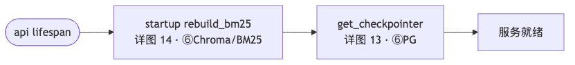

<details>
<summary>查看 Mermaid 源码（可编辑后运行 scripts/render_diagrams.py 重新出图）</summary>

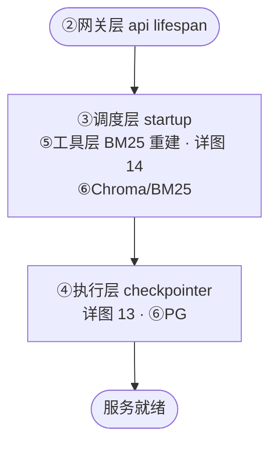
```mermaid
flowchart TD
    BOOT(["②网关层 api lifespan"]) --> S1["③调度层 startup<br/>⑤工具层 BM25 重建 · 详图 14<br/>⑥Chroma/BM25"]
    S1 --> S2["④执行层 checkpointer<br/>详图 13 · ⑥PG"]
    S2 --> READY([服务就绪])
```

</details>

---

## 六、层 4：执行层（LangGraph 核心）

### 6.1 完整 LangGraph 主图

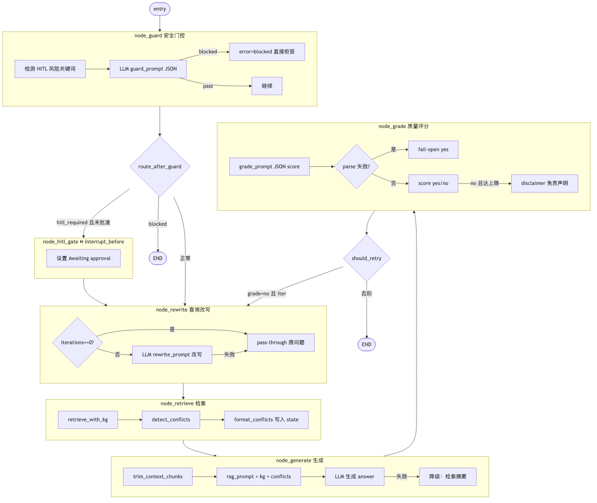

<details>
<summary>查看 Mermaid 源码（可编辑后运行 scripts/render_diagrams.py 重新出图）</summary>


```mermaid
flowchart TD
    ENTRY([entry]) --> GUARD

    subgraph GUARD["node_guard 安全门控"]
        G1[检测 HITL 风险关键词] --> G2[LLM guard_prompt JSON]
        G2 -->|blocked| G3[error=blocked 直接拒答]
        G2 -->|pass| G4[继续]
    end

    GUARD --> ROUTE{route_after_guard}

    ROUTE -->|blocked| END1([END])
    ROUTE -->|hitl_required 且未批准| HITL

    subgraph HITL["node_hitl_gate ⏸ interrupt_before"]
        H1[设置 Awaiting approval]
    end

    HITL --> REWRITE
    ROUTE -->|正常| REWRITE

    subgraph REWRITE["node_rewrite 查询改写"]
        RW1{iterations==0?}
        RW1 -->|是| RW2[pass-through 原问题]
        RW1 -->|否| RW3[LLM rewrite_prompt 改写]
        RW3 -->|失败| RW2
    end

    REWRITE --> RETRIEVE

    subgraph RETRIEVE["node_retrieve 检索"]
        RT[retrieve_with_kg] --> CF[detect_conflicts]
        CF --> FMT[format_conflicts 写入 state]
    end

    RETRIEVE --> GENERATE

    subgraph GENERATE["node_generate 生成"]
        GN1[trim_context_chunks] --> GN2[rag_prompt + kg + conflicts]
        GN2 --> GN3[LLM 生成 answer]
        GN3 -->|失败| GN4[降级：检索摘要]
    end

    GENERATE --> GRADE

    subgraph GRADE["node_grade 质量评分"]
        GR1[grade_prompt JSON score] --> GR2{parse 失败?}
        GR2 -->|是| GR3[fail-open yes]
        GR2 -->|否| GR4[score yes/no]
        GR4 -->|no 且达上限| GR5[disclaimer 免责声明]
    end

    GRADE --> RETRY{should_retry}

    RETRY -->|grade=no 且 iter<max| REWRITE
    RETRY -->|否则| END2([END])
```

</details>

**图拓扑（ASCII 速览）：**

```
entry → guard ─┬─ blocked ──────────────────────────────→ END
               ├─ hitl_required ─→ hitl_gate ⏸ ─→ rewrite
               └─ 正常 ─────────────────────────────→ rewrite
rewrite → retrieve → generate → grade ─┬─ no 且 iter<max → rewrite
                                       └─ 否则 ───────────→ END
```

### 6.2 RAGState 字段流转

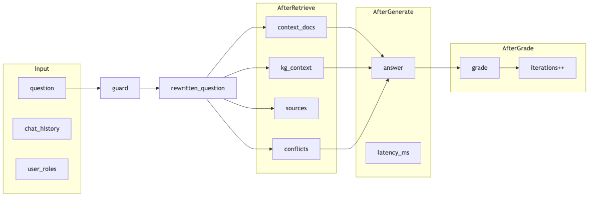

<details>
<summary>查看 Mermaid 源码（可编辑后运行 scripts/render_diagrams.py 重新出图）</summary>

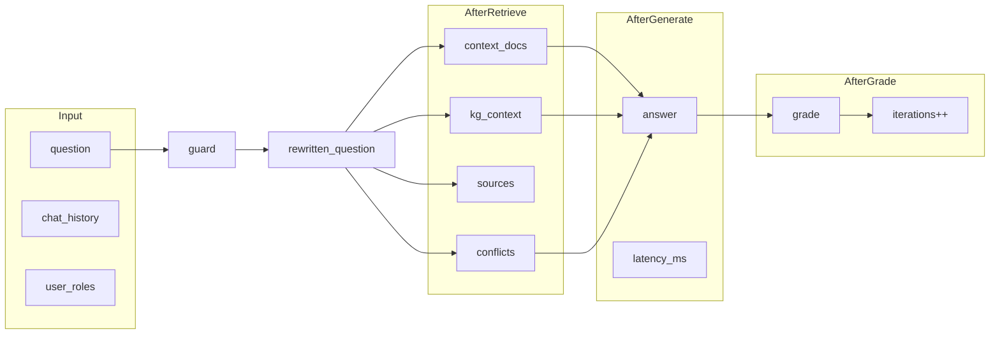
```mermaid
flowchart LR
    subgraph Input
        Q[question]
        H[chat_history]
        R[user_roles]
    end

    subgraph AfterRetrieve
        D[context_docs]
        K[kg_context]
        S[sources]
        C[conflicts]
    end

    subgraph AfterGenerate
        A[answer]
        L[latency_ms]
    end

    subgraph AfterGrade
        G[grade]
        I[iterations++]
    end

    Q --> GUARD2[guard] --> RW[rewritten_question]
    RW --> D & K & S & C
    D & K & C --> A
    A --> G --> I
```

</details>

**RAGState 字段分组（`graph/state.py`）：**

| 分组 | 字段 | 说明 |
|------|------|------|
| 输入 | question, rewritten_question, chat_history | 用户问题与多轮历史 |
| 检索 | context_docs, kg_context, sources, conflicts | 文档 + KG 证据 + 冲突 |
| 生成 | answer, grade, grade_reason, iterations, latency_ms, disclaimer | 回答与自校正 |
| 安全 | error, hitl_required, hitl_approved | 拦截与人工审批 |
| 权限 | user_roles, request_id | ACL 与追踪 |

### 6.3 Checkpointer 与 HITL 中断

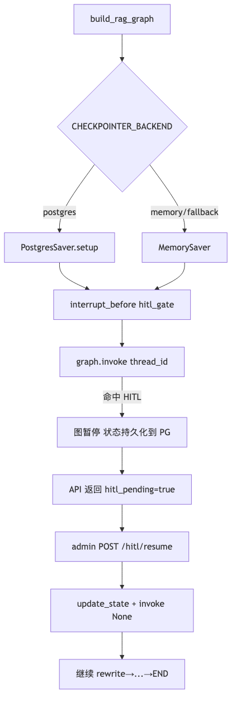

<details>
<summary>查看 Mermaid 源码（可编辑后运行 scripts/render_diagrams.py 重新出图）</summary>

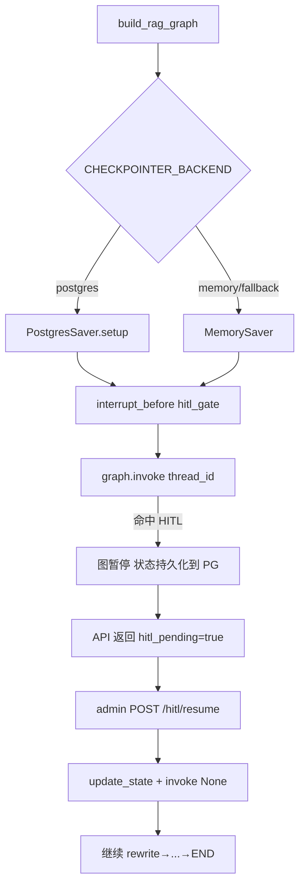
```mermaid
flowchart TD
    COMPILE[build_rag_graph] --> CP{CHECKPOINTER_BACKEND}
    CP -->|postgres| PG[PostgresSaver.setup]
    CP -->|memory/fallback| MEM[MemorySaver]

    PG & MEM --> INT[interrupt_before hitl_gate]

    INT --> RUN[graph.invoke thread_id]
    RUN -->|命中 HITL| PAUSE[图暂停 状态持久化到 PG]
    PAUSE --> WAIT[API 返回 hitl_pending=true]

    WAIT --> ADMIN[admin POST /hitl/resume]
    ADMIN --> RESUME[update_state + invoke None]
    RESUME --> CONTINUE[继续 rewrite→...→END]
```

</details>

---

## 七、层 5：工具层（Tools）

### 7.1 检索全流程（`tools/retriever.py`）

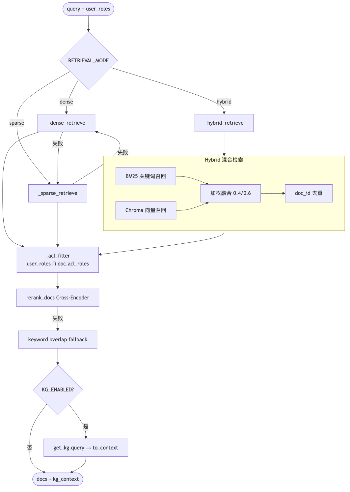

<details>
<summary>查看 Mermaid 源码（可编辑后运行 scripts/render_diagrams.py 重新出图）</summary>

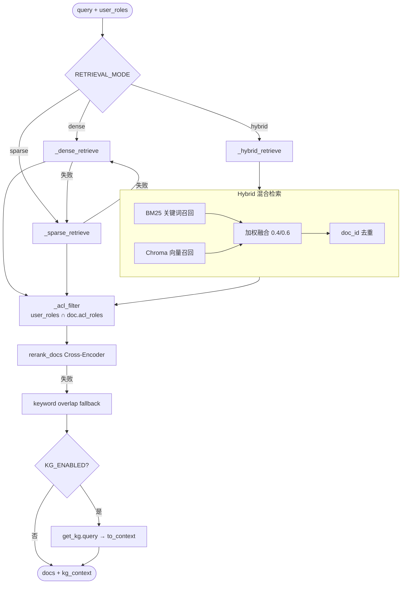
```mermaid
flowchart TD
    Q([query + user_roles]) --> MODE{RETRIEVAL_MODE}

    MODE -->|hybrid| HY[_hybrid_retrieve]
    MODE -->|dense| DE[_dense_retrieve]
    MODE -->|sparse| SP[_sparse_retrieve]

    subgraph HYBRID["Hybrid 混合检索"]
        H1[BM25 关键词召回] --> H3[加权融合 0.4/0.6]
        H2[Chroma 向量召回] --> H3
        H3 --> H4[doc_id 去重]
    end

    HY --> HYBRID
    DE -->|失败| SP
    SP -->|失败| DE

    HYBRID & DE & SP --> ACL[_acl_filter<br/>user_roles ∩ doc.acl_roles]

    ACL --> RER[rerank_docs Cross-Encoder]
    RER -->|失败| FB[keyword overlap fallback]

    FB --> KG{KG_ENABLED?}
    KG -->|是| KGQ[get_kg.query → to_context]
    KG -->|否| OUT
    KGQ --> OUT([docs + kg_context])
```

</details>

### 7.2 入库全流程（`tools/ingest.py`）

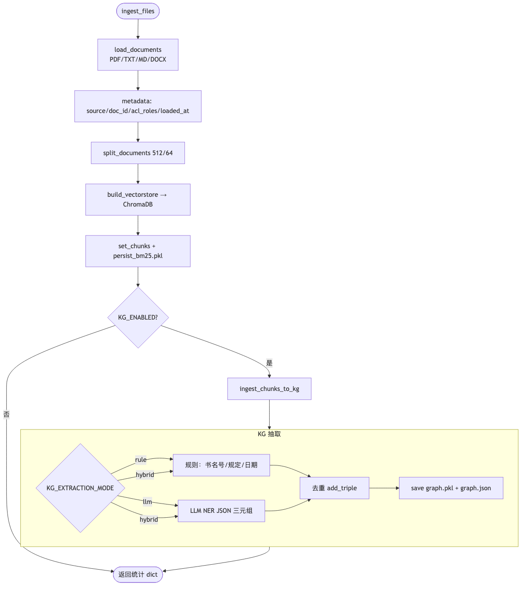

<details>
<summary>查看 Mermaid 源码（可编辑后运行 scripts/render_diagrams.py 重新出图）</summary>


```mermaid
flowchart TD
    START([ingest_files]) --> LOAD[load_documents<br/>PDF/TXT/MD/DOCX]
    LOAD --> META[metadata: source/doc_id/acl_roles/loaded_at]
    META --> SPLIT[split_documents 512/64]
    SPLIT --> VS[build_vectorstore → ChromaDB]
    VS --> BM25[set_chunks + persist_bm25.pkl]

    BM25 --> KG{KG_ENABLED?}
    KG -->|是| EXTRACT[ingest_chunks_to_kg]
    KG -->|否| DONE

    subgraph KG_PIPE["KG 抽取"]
        E1{KG_EXTRACTION_MODE}
        E1 -->|rule| E2[规则：书名号/规定/日期]
        E1 -->|llm| E3[LLM NER JSON 三元组]
        E1 -->|hybrid| E2 & E3
        E2 & E3 --> E4[去重 add_triple]
        E4 --> E5[save graph.pkl + graph.json]
    end

    EXTRACT --> KG_PIPE --> DONE([返回统计 dict])
```

</details>

### 7.3 冲突检测（`tools/conflict.py`）

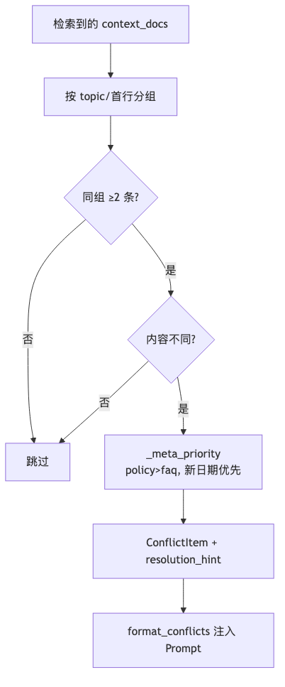

<details>
<summary>查看 Mermaid 源码（可编辑后运行 scripts/render_diagrams.py 重新出图）</summary>

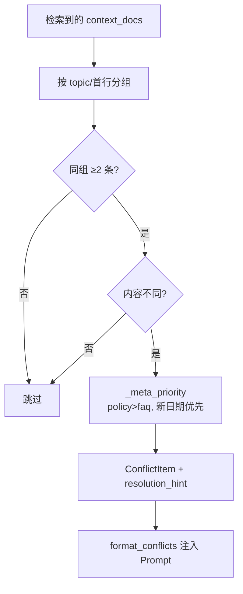
```mermaid
flowchart TD
    DOCS[检索到的 context_docs] --> GROUP[按 topic/首行分组]
    GROUP --> MULTI{同组 ≥2 条?}
    MULTI -->|否| SKIP[跳过]
    MULTI -->|是| DIFF{内容不同?}
    DIFF -->|否| SKIP
    DIFF -->|是| PRI[_meta_priority<br/>policy>faq, 新日期优先]
    PRI --> OUT[ConflictItem + resolution_hint]
    OUT --> FMT[format_conflicts 注入 Prompt]
```

</details>

### 7.4 知识图谱（`tools/knowledge_graph.py` + `kg_extractor.py`）

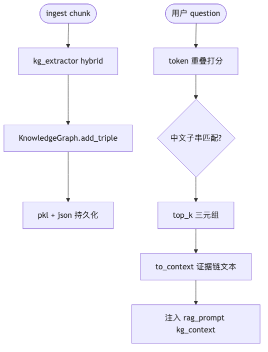

<details>
<summary>查看 Mermaid 源码（可编辑后运行 scripts/render_diagrams.py 重新出图）</summary>

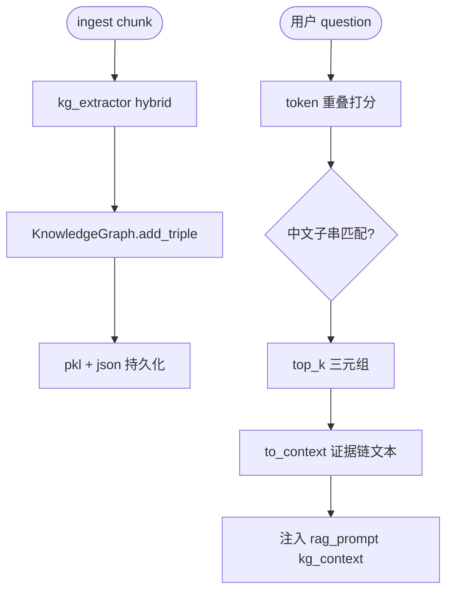
```mermaid
flowchart TD
    INGEST([ingest chunk]) --> EXT[kg_extractor hybrid]
    EXT --> ADD[KnowledgeGraph.add_triple]
    ADD --> SAVE[pkl + json 持久化]

    QUERY([用户 question]) --> TOK[token 重叠打分]
    TOK --> SUB{中文子串匹配?}
    SUB --> TOP[top_k 三元组]
    TOP --> CTX[to_context 证据链文本]
    CTX --> PROMPT[注入 rag_prompt kg_context]
```

</details>

---

## 八、层 6：基础设施层

### 8.1 Provider 工厂 + 熔断

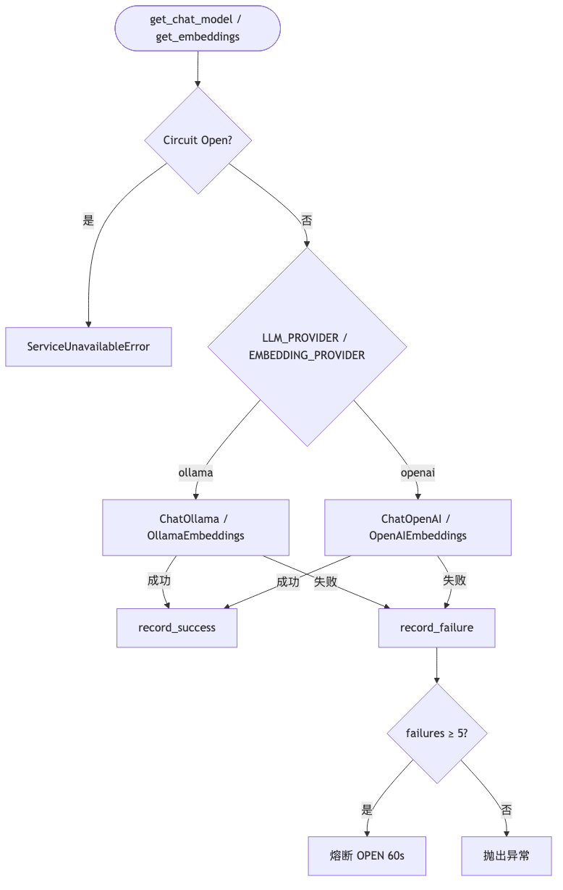

<details>
<summary>查看 Mermaid 源码（可编辑后运行 scripts/render_diagrams.py 重新出图）</summary>

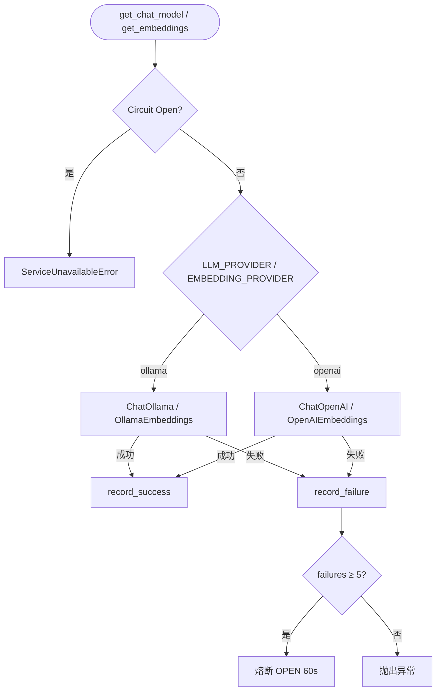
```mermaid
flowchart TD
    CALL([get_chat_model / get_embeddings]) --> CB{Circuit Open?}
    CB -->|是| E503[ServiceUnavailableError]
    CB -->|否| PROV{LLM_PROVIDER / EMBEDDING_PROVIDER}

    PROV -->|ollama| OLL[ChatOllama / OllamaEmbeddings]
    PROV -->|openai| OAI[ChatOpenAI / OpenAIEmbeddings]

    OLL & OAI -->|成功| OK[record_success]
    OLL & OAI -->|失败| FAIL[record_failure]
    FAIL --> TH{failures ≥ 5?}
    TH -->|是| OPEN[熔断 OPEN 60s]
    TH -->|否| RAISE[抛出异常]
```

</details>

### 8.2 超时控制（`core/timeouts.py`）

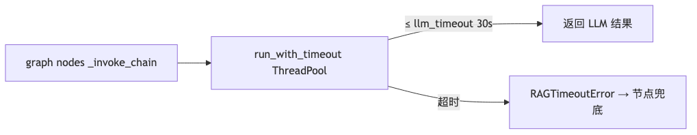

<details>
<summary>查看 Mermaid 源码（可编辑后运行 scripts/render_diagrams.py 重新出图）</summary>

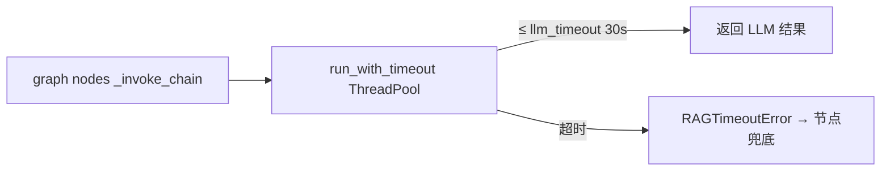
```mermaid
flowchart LR
    NODE[graph nodes _invoke_chain] --> TW[run_with_timeout ThreadPool]
    TW -->|≤ llm_timeout 30s| OK[返回 LLM 结果]
    TW -->|超时| E504[RAGTimeoutError → 节点兜底]
```

</details>

### 8.3 上下文压缩（`core/compression.py`）

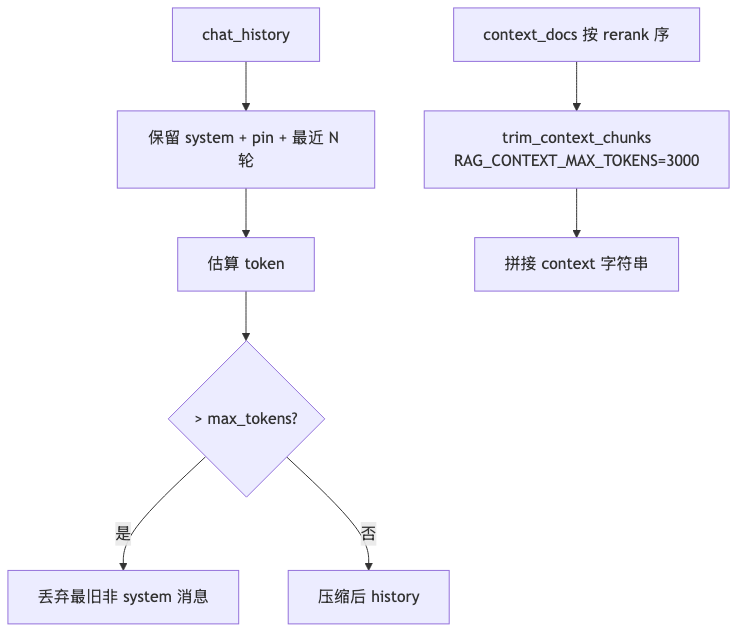

<details>
<summary>查看 Mermaid 源码（可编辑后运行 scripts/render_diagrams.py 重新出图）</summary>

```mermaid
flowchart TD
    MSG[chat_history] --> KEEP[保留 system + pin + 最近 N 轮]
    KEEP --> EST[估算 token]
    EST --> OVER{> max_tokens?}
    OVER -->|是| TRIM[丢弃最旧非 system 消息]
    OVER -->|否| OUT1[压缩后 history]

    CHUNKS[context_docs 按 rerank 序] --> BUDGET[trim_context_chunks<br/>RAG_CONTEXT_MAX_TOKENS=3000]
    BUDGET --> OUT2[拼接 context 字符串]
```

</details>

### 8.4 Docker 部署拓扑

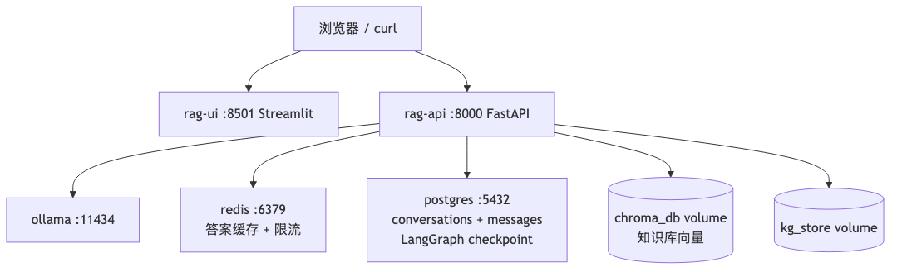

<details>
<summary>查看 Mermaid 源码（可编辑后运行 scripts/render_diagrams.py 重新出图）</summary>

```mermaid
flowchart TB
    USER[浏览器 / curl] --> UI[rag-ui :8501 Streamlit]
    USER --> API[rag-api :8000 FastAPI]

    API --> OLL[ollama :11434]
    API --> REDIS[redis :6379<br/>答案缓存 + 限流]
    API --> PG["postgres :5432<br/>conversations + messages<br/>LangGraph checkpoint"]
    API --> VOL1[(chroma_db volume<br/>知识库向量)]
    API --> VOL2[(kg_store volume)]
```

</details>

| Service | Port | Role |
|---------|------|------|
| rag-api | 8000 | FastAPI |
| rag-ui | 8501 | Streamlit |
| ollama | 11434 | LLM + Embed |
| redis | 6379 | Cache + rate limit |
| postgres | 5432 | conversations + messages + HITL checkpoint |

### 8.5 会话存储（`storage/conversations.py`）

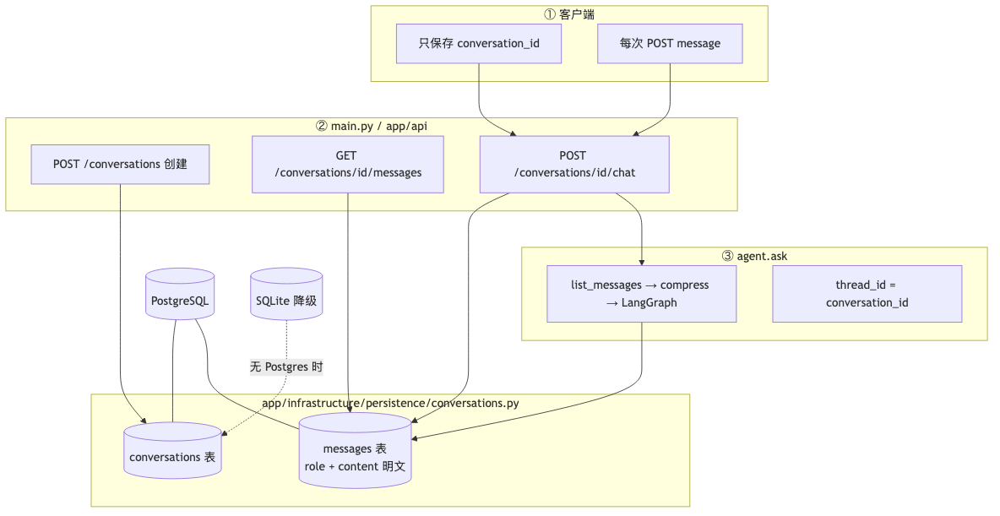

<details>
<summary>查看 Mermaid 源码（可编辑后运行 scripts/render_diagrams.py 重新出图）</summary>

```mermaid
flowchart TD
    subgraph Client["① 客户端"]
        C1[只保存 conversation_id]
        C2[每次 POST message]
    end

    subgraph API["② api.py"]
        A1[POST /conversations 创建]
        A2[GET /conversations/id/messages]
        A3[POST /conversations/id/chat]
    end

    subgraph Store["storage/conversations.py"]
        S1[(conversations 表)]
        S2[(messages 表<br/>role + content 明文)]
    end

    subgraph Agent["③ agent.ask"]
        G1[list_messages → compress → LangGraph]
        G2[thread_id = conversation_id]
    end

    C1 --> A3
    C2 --> A3
    A1 --> S1
    A3 --> S2
    A3 --> G1
    G1 --> S2
    A2 --> S2

    PG[(PostgreSQL)] --- S1
    PG --- S2
    SQLITE[(SQLite 降级)] -.->|无 Postgres 时| S1
```

</details>

---

## 九、API 端点速查

| 方法 | 路径 | 权限 | 对应流程 |
|------|------|------|----------|
| POST | `/auth/token` | 公开 | 层2 鉴权 |
| POST | `/conversations` | chat | 创建会话，返回 `conversation_id` |
| GET | `/conversations` | chat | 列出当前用户会话 |
| GET | `/conversations/{id}/messages` | chat | 读取会话历史（服务端权威） |
| POST | `/conversations/{id}/chat` | chat | **推荐**：DB 加载 history → 层3 ask → 落库 |
| POST | `/conversations/{id}/chat/stream` | chat | 流式版 |
| POST | `/chat` | chat | 兼容：无 `conversation_id` 时自动创建 |
| POST | `/chat/stream` | chat | 兼容流式 |
| POST | `/hitl/resume` | admin | 层3 resume_hitl（`thread_id=conversation_id`） |
| POST | `/ingest` | admin/editor | 层5 入库 |
| GET | `/health` | 公开 | 存活探针 |
| GET | `/ready` | 公开 | Chroma + 熔断检查 |
| GET | `/stats` | health | BM25/KG/索引统计 |
| GET | `/metrics` | admin | 请求/缓存/HITL 计数 |

---

## 十、Eval 集成

```bash
# 默认评测 project_00
python eval/harness/run_eval.py --project 00 --prompt v1

# 对比 legacy project_01
python eval/harness/run_eval.py --project 01 --prompt v1

# 回归门禁
python eval/harness/run_eval.py --project 00 --prompt v2 --regression
```

---

## 十一、与 project_01 差异摘要

| 能力 | project_01 | project_00 |
|------|-----------|------------|
| Provider | 仅 Ollama | Ollama / OpenAI 可切换 |
| 鉴权 | 无 | JWT + RBAC |
| 缓存/限流 | 无 | Redis 答案缓存 + 限流（history 不在 Redis） |
| 会话存储 | 无 | PostgreSQL `conversation_id` + messages 表 |
| BM25 | 内存，重启丢失 | pickle 持久化 + 启动重建 |
| KG | 无 | 规则 + LLM hybrid 抽取 |
| HITL | 无 | interrupt_before + Postgres |
| 冲突检测 | 无 | metadata 优先级 |
| guard 节点 | 无 | 安全门控 |
| ACL | 无 | chunk metadata acl_roles |

---

## 十二、一句话串起来（面试可背）

> **Client** 持 `conversation_id` 调 **API**（JWT + 限流）→ **DB 加载 chat_history** → **agent** 压缩历史 + 查**答案**缓存 → **LangGraph**（guard → 可选 HITL → rewrite → hybrid 检索 + ACL + KG → generate → grade）→ **落库 user/assistant 消息** → 返回答案；**ingest** 写 Chroma + BM25 + KG；**Redis** 只缓存答案与限流，不存聊天记录。
