# project_00_rag_agent — 分层架构与核心流程

> **流程图已导出为 PNG**：见 [`docs/diagrams/`](./diagrams/)。修改图源文件 `docs/diagrams/source/*.mmd` 后执行 `python scripts/render_diagrams.py` 重新生成。

> 生产级 RAG Agent：LangGraph + JWT/RBAC + Hybrid 检索 + 知识图谱 + HITL + Redis 缓存

---

## 一、目录结构总览

```
project_00_rag_agent/
├── agent.py                 # 对外入口：ask / ask_stream / resume_hitl / startup
├── api.py                   # FastAPI HTTP 层
├── app.py                   # Streamlit UI（Local / API 双模式）
├── config.py                # pydantic-settings 全量配置
│
├── core/                    # 横切能力
│   ├── compression.py       # 对话压缩 + RAG context 预算
│   ├── timeouts.py          # LLM 调用超时
│   ├── circuit_breaker.py   # LLM/Embed 熔断
│   └── exceptions.py        # 结构化错误码
│
├── middleware/              # 网关中间件
│   ├── auth.py              # JWT + RBAC
│   ├── cache.py             # Redis 答案缓存
│   ├── rate_limit.py        # 限流
│   └── request_context.py   # request_id
│
├── providers/               # 模型 Provider 抽象
│   └── factory.py           # Ollama / OpenAI 切换
│
├── graph/                   # LangGraph 核心
│   ├── state.py             # RAGState
│   ├── nodes.py             # guard/rewrite/retrieve/generate/grade/hitl
│   ├── edges.py             # 条件路由
│   ├── builder.py           # 编译图 + interrupt_before
│   └── checkpointer.py      # Memory / Postgres 持久化
│
├── tools/                   # 业务工具
│   ├── retriever.py         # Hybrid + ACL + Rerank + KG
│   ├── ingest.py            # 安全入库
│   ├── knowledge_graph.py   # 三元组存储/查询
│   ├── kg_extractor.py      # 规则 + LLM NER 抽取
│   └── conflict.py          # 文档冲突检测
│
├── prompts/rag_prompts.py   # guard / rewrite / rag / grade
├── observability/metrics.py # 指标计数
├── tests/                   # 单元 + API + 集成测试
├── sample_docs/             # 样例知识库
├── Dockerfile + docker-compose.yml
└── docs/architecture.md     # 本文档
```

---

## 二、六层架构（自上而下）

**阅读顺序**：先看本图建立全栈心智模型 → 再按层阅读第三节～第八节（每层有职责说明 + 专属流程图）。


<details>
<summary>查看 Mermaid 源码（可编辑后运行 scripts/render_diagrams.py 重新出图）</summary>

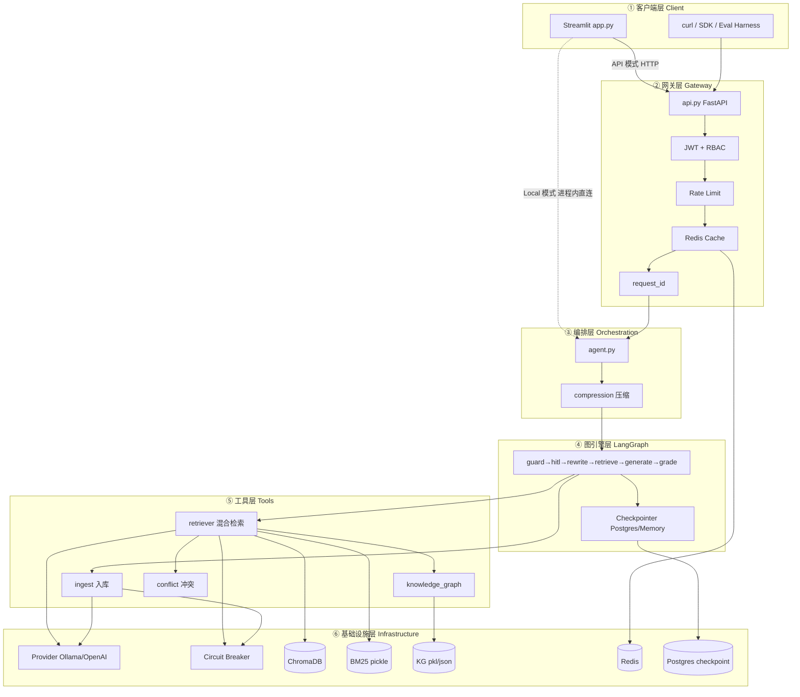

</details>

### 2.1 分层阅读索引（全栈 → 每层做什么）

| 层 | 职责（一句话） | 主要代码 | 本文章节 | 核心流程图 |
|----|----------------|----------|----------|------------|
| **① 客户端** | 收集输入、展示结果；API 模式发 HTTP，Local 模式直连 agent | `app.py`, eval harness | **三** | `02` UI 全栈路径、`03` Eval |
| **② 网关** | 鉴权、限流、缓存、request_id；**仅 API 部署走此层** | `api.py`, `middleware/*` | **四** | `04` 网关入口、`05` JWT、`06` 缓存限流 |
| **③ 编排** | 压缩历史、查缓存、组装 state、调用 LangGraph | `agent.py` | **五** | `07` ask、`08` ask_stream、`09` HITL resume、`10` startup |
| **④ 图引擎** | guard/HITL/改写/检索/生成/评分的有状态工作流 | `graph/*` | **六** | `11` 主图、`12` State、`13` Checkpointer |
| **⑤ 工具** | 入库、混合检索、KG、冲突检测 | `tools/*` | **七** | `14` 检索、`15` ingest、`16` 冲突、`17` KG |
| **⑥ 基础设施** | 模型调用、熔断、超时、持久化存储 | `providers/`, `core/`, 磁盘/Redis/PG | **八** | `18` 熔断、`19` 超时、`20` 压缩、`21` Docker |

**两条部署路径（务必区分）：**

| 路径 | 客户端 → 后端 | 何时使用 |
|------|----------------|----------|
| **生产 / API 模式** | Streamlit → **② 网关** → ③ → ④ → ⑤ → ⑥ → JSON 回 UI → 展示 | `Use API backend` 开启 |
| **本地 / Local 模式** | Streamlit → **③ agent 直连**（跳过 ②）→ ④ → ⑤ → ⑥ → 流式/元数据回 UI | 默认本地开发 |

`02_streamlit_ui` 图同时画出上述两条路径；**不是** UI 自己生成答案，中间必经 ③～⑥（API 模式还多一层 ②）。

---

## 三、层 1：客户端层

**本层职责**：人机交互、会话状态（`messages` / `token` / `thread_id`）、把用户操作转为 HTTP 或进程内调用；**不负责**检索与生成。

### 3.1 Streamlit UI 全栈路径（`app.py`）

下图在 **① 客户端视角** 画出完整调用链：API 模式经 **② 网关** 再进入 **③～⑥**；Local 模式跳过网关直连 agent。终点 `SHOW` 是网关/agent 返回 JSON 或流式 token **之后** 的 UI 渲染。


<details>
<summary>查看 Mermaid 源码（可编辑后运行 scripts/render_diagrams.py 重新出图）</summary>

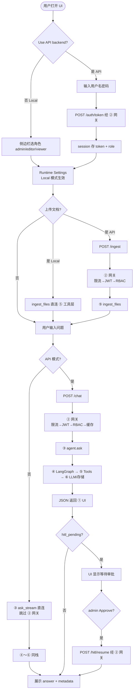

</details>

### 3.2 Eval Harness 流程（`eval/harness/run_eval.py`）


<details>
<summary>查看 Mermaid 源码（可编辑后运行 scripts/render_diagrams.py 重新出图）</summary>

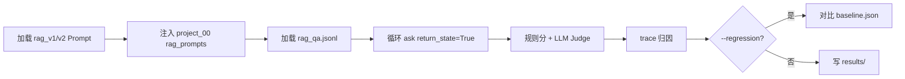

</details>

---

## 四、层 2：网关层（`api.py` + `middleware/`）

### 4.1 请求总入口（所有 HTTP 请求）


<details>
<summary>查看 Mermaid 源码（可编辑后运行 scripts/render_diagrams.py 重新出图）</summary>

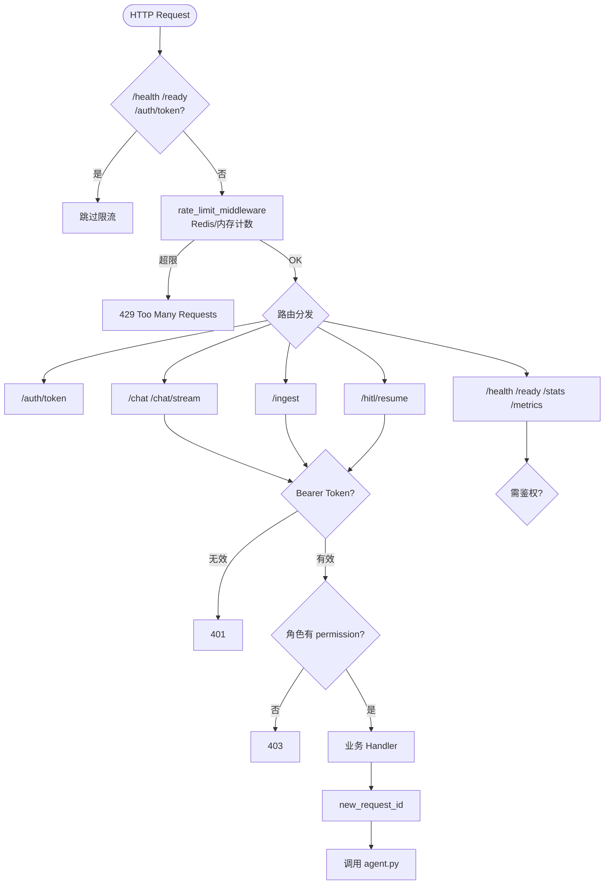

</details>

### 4.2 JWT 鉴权 + RBAC 流程（`middleware/auth.py`）


<details>
<summary>查看 Mermaid 源码（可编辑后运行 scripts/render_diagrams.py 重新出图）</summary>

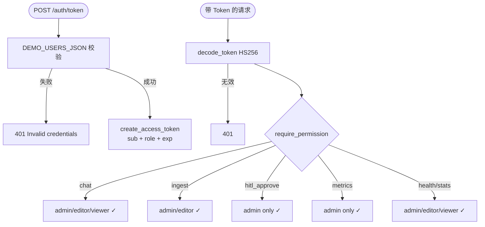

</details>

**角色权限表：**

| 角色 | chat | ingest | hitl_approve | metrics | health/stats |
|------|------|--------|--------------|---------|--------------|
| admin | ✓ | ✓ | ✓ | ✓ | ✓ |
| editor | ✓ | ✓ | ✗ | ✗ | ✓ |
| viewer | ✓ | ✗ | ✗ | ✗ | ✓ |

### 4.3 缓存 + 限流流程


<details>
<summary>查看 Mermaid 源码（可编辑后运行 scripts/render_diagrams.py 重新出图）</summary>

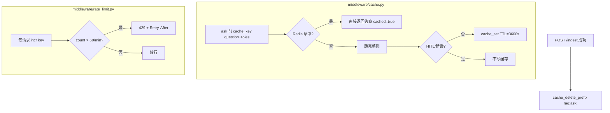

</details>

---

## 五、层 3：编排层（`agent.py`）

### 5.1 `ask()` 同步问答主流程


<details>
<summary>查看 Mermaid 源码（可编辑后运行 scripts/render_diagrams.py 重新出图）</summary>

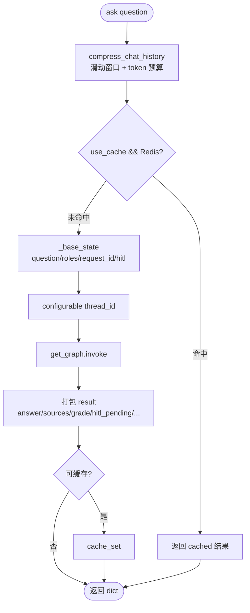

</details>

### 5.2 `ask_stream()` 流式问答流程


<details>
<summary>查看 Mermaid 源码（可编辑后运行 scripts/render_diagrams.py 重新出图）</summary>

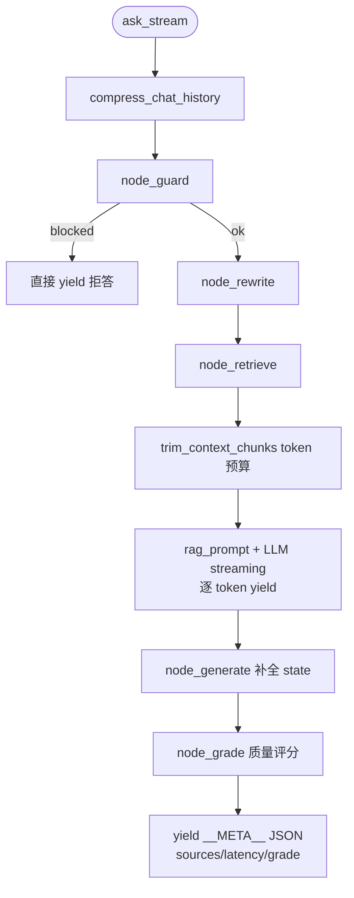

</details>

### 5.3 `resume_hitl()` HITL 恢复流程


<details>
<summary>查看 Mermaid 源码（可编辑后运行 scripts/render_diagrams.py 重新出图）</summary>

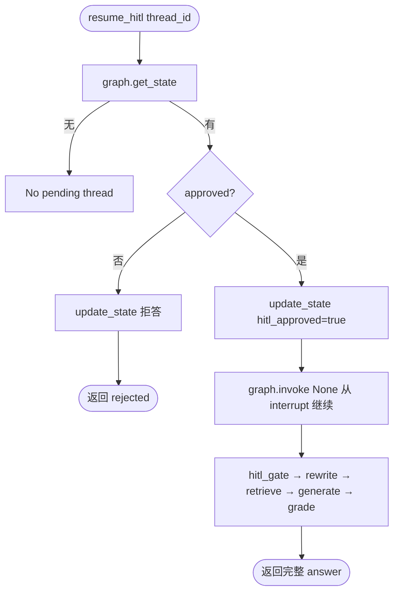

</details>

### 5.4 启动预热（`startup()`）


<details>
<summary>查看 Mermaid 源码（可编辑后运行 scripts/render_diagrams.py 重新出图）</summary>

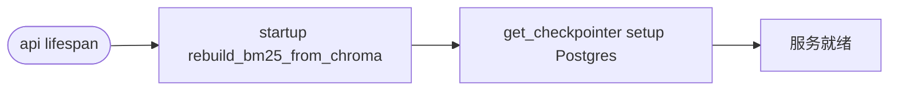

</details>

---

## 六、层 4：图引擎层（LangGraph 核心）

### 6.1 完整 LangGraph 主图


<details>
<summary>查看 Mermaid 源码（可编辑后运行 scripts/render_diagrams.py 重新出图）</summary>

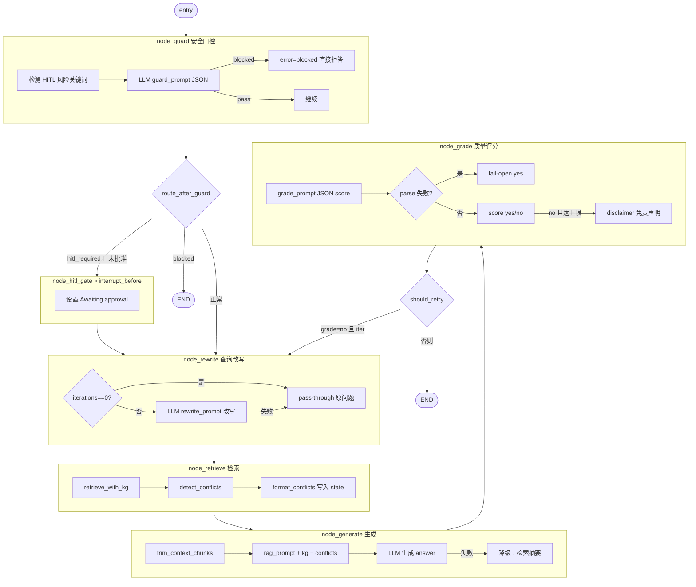

</details>

**图拓扑（ASCII 速览）：**

```
entry → guard ─┬─ blocked ──────────────────────────────→ END
               ├─ hitl_required ─→ hitl_gate ⏸ ─→ rewrite
               └─ 正常 ─────────────────────────────→ rewrite
rewrite → retrieve → generate → grade ─┬─ no 且 iter<max → rewrite
                                       └─ 否则 ───────────→ END
```

### 6.2 RAGState 字段流转


<details>
<summary>查看 Mermaid 源码（可编辑后运行 scripts/render_diagrams.py 重新出图）</summary>

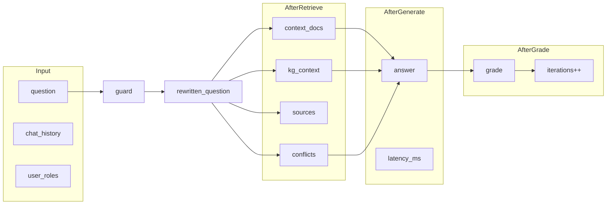

</details>

**RAGState 字段分组（`graph/state.py`）：**

| 分组 | 字段 | 说明 |
|------|------|------|
| 输入 | question, rewritten_question, chat_history | 用户问题与多轮历史 |
| 检索 | context_docs, kg_context, sources, conflicts | 文档 + KG 证据 + 冲突 |
| 生成 | answer, grade, grade_reason, iterations, latency_ms, disclaimer | 回答与自校正 |
| 安全 | error, hitl_required, hitl_approved | 拦截与人工审批 |
| 权限 | user_roles, request_id | ACL 与追踪 |

### 6.3 Checkpointer 与 HITL 中断


<details>
<summary>查看 Mermaid 源码（可编辑后运行 scripts/render_diagrams.py 重新出图）</summary>

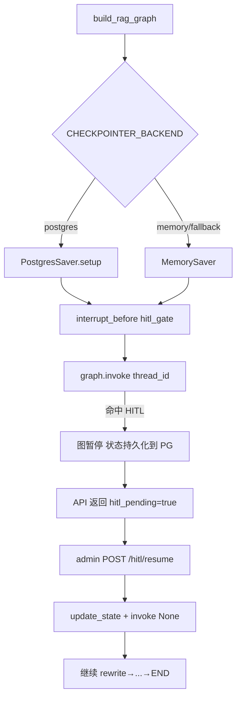

</details>

---

## 七、层 5：工具层（Tools）

### 7.1 检索全流程（`tools/retriever.py`）


<details>
<summary>查看 Mermaid 源码（可编辑后运行 scripts/render_diagrams.py 重新出图）</summary>


</details>

### 7.2 入库全流程（`tools/ingest.py`）


<details>
<summary>查看 Mermaid 源码（可编辑后运行 scripts/render_diagrams.py 重新出图）</summary>

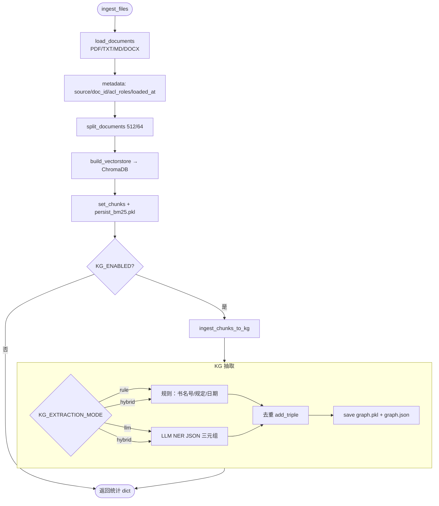

</details>

### 7.3 冲突检测（`tools/conflict.py`）


<details>
<summary>查看 Mermaid 源码（可编辑后运行 scripts/render_diagrams.py 重新出图）</summary>

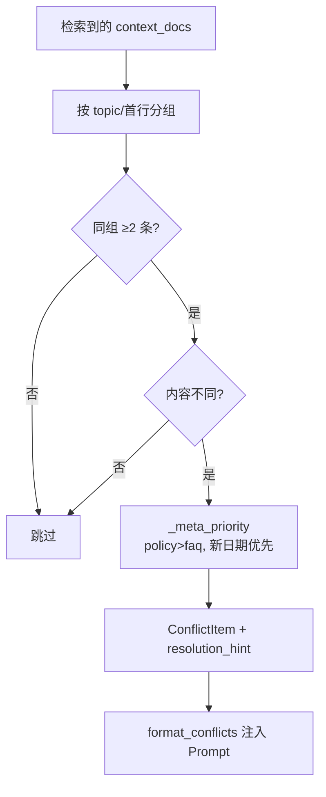

</details>

### 7.4 知识图谱（`tools/knowledge_graph.py` + `kg_extractor.py`）


<details>
<summary>查看 Mermaid 源码（可编辑后运行 scripts/render_diagrams.py 重新出图）</summary>


</details>

---

## 八、层 6：基础设施层

### 8.1 Provider 工厂 + 熔断


<details>
<summary>查看 Mermaid 源码（可编辑后运行 scripts/render_diagrams.py 重新出图）</summary>


</details>

### 8.2 超时控制（`core/timeouts.py`）


<details>
<summary>查看 Mermaid 源码（可编辑后运行 scripts/render_diagrams.py 重新出图）</summary>

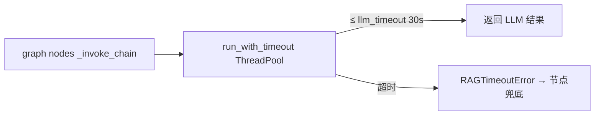

</details>

### 8.3 上下文压缩（`core/compression.py`）


<details>
<summary>查看 Mermaid 源码（可编辑后运行 scripts/render_diagrams.py 重新出图）</summary>

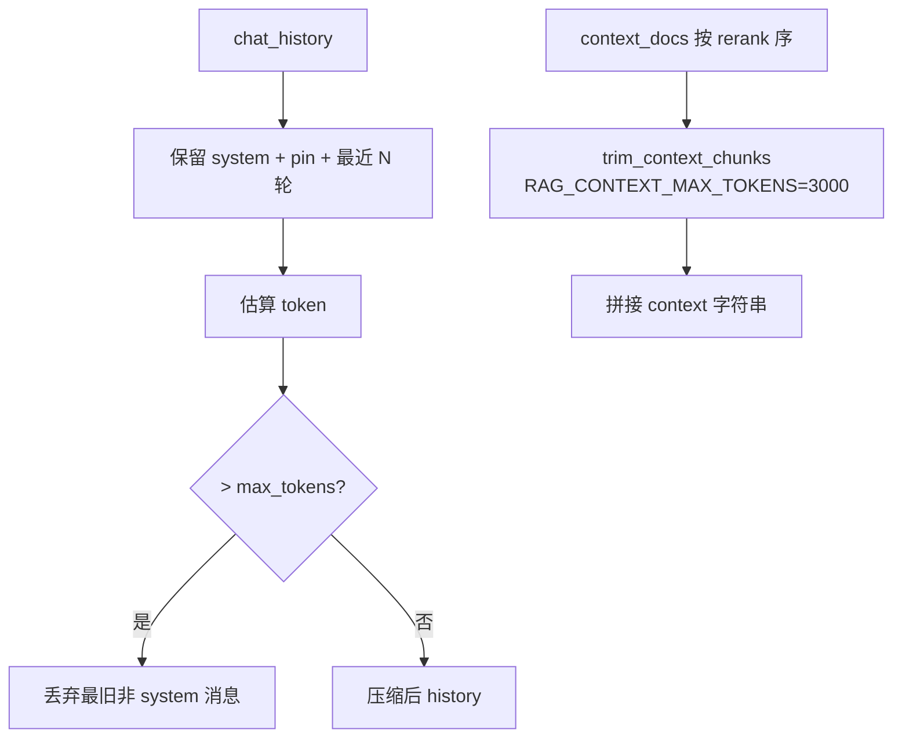

</details>

### 8.4 Docker 部署拓扑


<details>
<summary>查看 Mermaid 源码（可编辑后运行 scripts/render_diagrams.py 重新出图）</summary>

```mermaid
flowchart TB
    USER[浏览器 / curl] --> UI[rag-ui :8501 Streamlit]
    USER --> API[rag-api :8000 FastAPI]

    API --> OLL[ollama :11434]
    API --> REDIS[redis :6379]
    API --> PG[postgres :5432 checkpoint]
    API --> VOL1[(chroma_db volume)]
    API --> VOL2[(kg_store volume)]
```

</details>

| Service | Port | Role |
|---------|------|------|
| rag-api | 8000 | FastAPI |
| rag-ui | 8501 | Streamlit |
| ollama | 11434 | LLM + Embed |
| redis | 6379 | Cache + rate limit |
| postgres | 5432 | HITL checkpoint |

---

## 九、API 端点速查

| 方法 | 路径 | 权限 | 对应流程 |
|------|------|------|----------|
| POST | `/auth/token` | 公开 | 层2 鉴权 |
| POST | `/chat` | chat | 层3 ask → 层4 全图 |
| POST | `/chat/stream` | chat | 层3 ask_stream |
| POST | `/hitl/resume` | admin | 层3 resume_hitl |
| POST | `/ingest` | admin/editor | 层5 入库 |
| GET | `/health` | 公开 | 存活探针 |
| GET | `/ready` | 公开 | Chroma + 熔断检查 |
| GET | `/stats` | health | BM25/KG/索引统计 |
| GET | `/metrics` | admin | 请求/缓存/HITL 计数 |

---

## 十、Eval 集成

```bash
# 默认评测 project_00
python eval/harness/run_eval.py --project 00 --prompt v1

# 对比 legacy project_01
python eval/harness/run_eval.py --project 01 --prompt v1

# 回归门禁
python eval/harness/run_eval.py --project 00 --prompt v2 --regression
```

---

## 十一、与 project_01 差异摘要

| 能力 | project_01 | project_00 |
|------|-----------|------------|
| Provider | 仅 Ollama | Ollama / OpenAI 可切换 |
| 鉴权 | 无 | JWT + RBAC |
| 缓存/限流 | 无 | Redis + 内存 fallback |
| BM25 | 内存，重启丢失 | pickle 持久化 + 启动重建 |
| KG | 无 | 规则 + LLM hybrid 抽取 |
| HITL | 无 | interrupt_before + Postgres |
| 冲突检测 | 无 | metadata 优先级 |
| guard 节点 | 无 | 安全门控 |
| ACL | 无 | chunk metadata acl_roles |

---

## 十二、一句话串起来（面试可背）

> **Client** 调 **API**（JWT + 限流）→ **agent** 压缩历史 + 查缓存 → **LangGraph**（guard → 可选 HITL 中断 → rewrite → **hybrid 检索 + ACL + KG + 冲突** → generate → grade 重试）→ **Provider** 调 LLM（带超时/熔断）→ 返回答案；**ingest** 走独立流水线写 Chroma + BM25 + KG。
